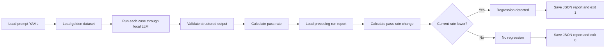

# LLM Regression Detector

[](https://github.com/gowrav32-create/llm-regression-detector/actions/workflows/tests.yml)

A local evaluation and regression-testing system for LLM-powered application features.

This project evaluates a customer-support email classifier against a fixed golden dataset, stores timestamped run reports, compares each run with the preceding run, and returns a failing process exit code when model performance regresses.

The classifier runs locally with **Ollama** and `llama3.2:3b`; no paid cloud API is required.

## Why This Project Exists

LLM application behavior can change when developers modify:

- prompts;
- model versions;
- inference settings;
- schemas;
- application logic;
- datasets.

A change that appears harmless can reduce task accuracy. This project introduces a repeatable evaluation gate that detects those regressions before a change is accepted.

## Current Feature

The evaluated feature classifies a customer-support email into exactly one category:

- `billing`
- `technical`
- `account`
- `general`

It also generates a one-sentence summary.

Example structured output:

```json
{
  "category": "billing",
  "summary": "The customer is requesting clarification about an invoice charge."
}
```

Pydantic validates every model response before it is included in an evaluation report.

## Evaluation Results

| Evaluated version | Passed | Pass rate |
|---|---:|---:|
| Rule-based baseline | 5/6 | 83.33% |
| Prompt v1 | 4/6 | 66.67% |
| Prompt v2 | 4/6 | 66.67% |
| Prompt v3 | 6/6 | 100.00% |

Prompt v3 corrected the two failures observed in v1 and v2.

> The current golden dataset contains only six cases. A 100% score confirms that v3 passes this test set; it does not establish production-level accuracy or generalization.

## How Regression Detection Works



The comparison rule is:

```text
current pass rate < previous pass rate → regression detected
```

A regression causes the evaluator to return exit code `1`, allowing a CI/CD pipeline to fail automatically.

## Project Structure

```text
llm-regression-detector/
├── .github/
│   └── workflows/
│       └── tests.yml
├── datasets/
│   └── golden_dataset_v1.json
├── prompts/
│   ├── prompt_v1.yaml
│   ├── prompt_v2.yaml
│   └── prompt_v3.yaml
├── runs/
│   ├── ollama_v1_baseline.json
│   ├── ollama_v2_results.json
│   └── ollama_v3_results.json
├── src/
│   ├── evaluator.py
│   ├── llm_feature.py
│   ├── ollama_smoke.py
│   ├── regression.py
│   └── schemas.py
├── tests/
│   ├── test_regression.py
│   └── test_schemas.py
├── pytest.ini
├── requirements.txt
└── README.md
```

Timestamped reports generated by the evaluator are stored under `runs/` and ignored by Git. Curated benchmark reports remain version-controlled.

## Requirements

- Python 3.13 or a compatible recent Python version
- Ollama
- `llama3.2:3b`
- Git

## Local Setup

### 1. Clone the repository

```powershell
git clone https://github.com/gowrav32-create/llm-regression-detector.git
cd llm-regression-detector
```

### 2. Create and activate a virtual environment

Windows PowerShell:

```powershell
python -m venv .venv
.\.venv\Scripts\Activate.ps1
```

macOS or Linux:

```bash
python3 -m venv .venv
source .venv/bin/activate
```

### 3. Install Python dependencies

```powershell
python -m pip install --upgrade pip
python -m pip install -r requirements.txt
```

### 4. Install and prepare the local model

After installing Ollama, pull the model:

```powershell
ollama pull llama3.2:3b
```

Confirm that Ollama can run it:

```powershell
ollama run llama3.2:3b
```

## Run the Evaluator

Run the current prompt explicitly:

```powershell
python src\evaluator.py --prompt prompts\prompt_v3.yaml
```

Because v3 is the default, this also works:

```powershell
python src\evaluator.py
```

Example ending:

```text
Passed: 6/6
Pass rate: 100.00%
Previous pass rate: 100.0
Pass rate change: 0.0
Regression detected: False
Evaluation passed: no regression detected.
```

Check the process exit code in PowerShell:

```powershell
$LASTEXITCODE
```

Expected stable-run result:

```text
0
```

## Evaluate a New Prompt Version

Create another versioned YAML file, such as:

```text
prompts/prompt_v4.yaml
```

Then run:

```powershell
python src\evaluator.py --prompt prompts\prompt_v4.yaml
```

The evaluator will:

1. run the same golden cases;
2. calculate the new pass rate;
3. compare it with the most recent prior run;
4. save a timestamped JSON report;
5. return exit code `1` when performance declines.

## Run Unit Tests

```powershell
python -m pytest -v
```

The current tests verify:

- valid LLM categories are accepted;
- invalid LLM categories are rejected;
- a lower pass rate is identified as a regression;
- an unchanged pass rate is not identified as a regression;
- the absence of a prior run is handled safely.

These tests do not call Ollama, so they are deterministic and suitable for GitHub Actions.

## Continuous Integration

The GitHub Actions workflow runs on every push and pull request.

It:

1. checks out the repository;
2. installs Python;
3. installs dependencies;
4. runs the unit-test suite.

The CI workflow intentionally does not start Ollama. Live-model evaluation remains a local integration step, while deterministic regression and schema logic is covered in CI.

## Report Format

Each evaluator run produces a JSON report similar to:

```json
{
  "timestamp": "2026-07-22_13-41-52",
  "prompt_version": "v3",
  "model": "llama3.2:3b",
  "total_cases": 6,
  "passed_cases": 6,
  "pass_rate": 100.0,
  "comparison": {
    "previous_report": "v3_2026-07-22_13-33-11.json",
    "previous_pass_rate": 100.0,
    "pass_rate_change": 0.0,
    "regression_detected": false
  },
  "results": []
}
```

The complete report includes one detailed result object for every golden test case.

## Engineering Decisions

### Versioned prompts

Prompts are stored as YAML files so changes can be reviewed, reproduced, and compared.

### Fixed golden dataset

Stable case IDs allow failures to be tracked across prompt and model versions.

### Typed structured output

Pydantic rejects malformed categories and invalid model responses.

### Local inference

Ollama keeps inference local and removes dependence on paid API credits.

### Timestamped reports

Every run creates an auditable record of the prompt version, model, pass rate, comparison, and case-level outcomes.

### CI-safe unit tests

Model-independent logic is separated into testable functions so CI remains fast and deterministic.

## Next Development Milestones

- Refactor `evaluator.py` into import-safe functions.
- Add evaluator tests using a mocked classifier.
- Compare case-level regressions, not only aggregate pass rate.
- Add summary-quality evaluation.
- Add minimum-score and maximum-drop thresholds.
- Support explicit baseline selection.
- Add multiple model configurations.
- Expand the golden dataset with harder and adversarial examples.
- Generate a Markdown or HTML regression report.
- Add optional Slack or email notifications.

## Author

**Gowrav Shivakumara**

GitHub: [@gowrav32-create](https://github.com/gowrav32-create)